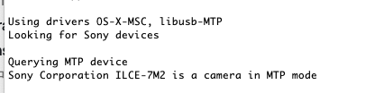

# Sony 微单安装破解 App
## 步骤
1、下载 PMCADownload 驱动程序
2、到这个 GitHub 下载 https://github.com/ma1co/Sony-PMCA-RE/releases（最高版本可能需要翻墙），也可以直接下载该仓库内的文件
3、将相机 【USB】连接调成 【MTP】
4、USB 连接电脑
5、打开 PMCA，点击 【Get Camera Info】，看到相机信息即为成功

6、安装你想要的 App

## 推荐 App
* 智能遥控
* 延时拍摄
* 数字滤镜
* 平滑反射
* 镜头补偿
* 多重曝光